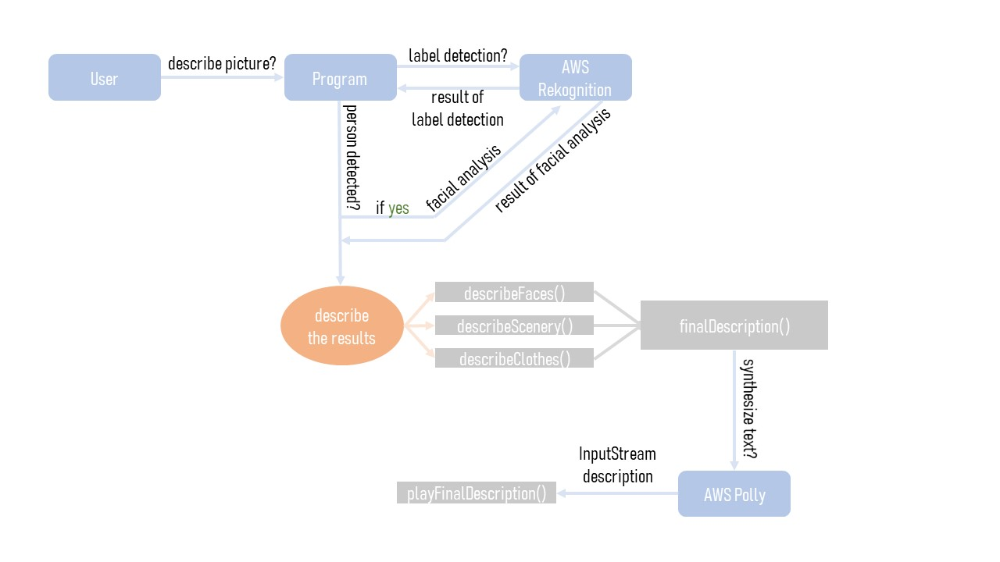

# PhotoDescriptionGenerator
A Java application that uses AWS Rekognition and Polly to create a short description of a given photo.

For determining if there are any people in the photo and details about them (including their genders, ages, moods etc.), Rekognition's Facial Analysis is used (function: _describeFaces()_). 
For determining people's clothes and their surroundings, Rekognition's Label Detection is used (functions: _describeScenery()_ and _describeClothes()_).

These three functions generate the text that gets passed to function _playFinalDescription()_, which uses Polly to generate human-like speech. 

An extremely simple Spring GUI is used for interface that lets a user search for a photo on their computer via a File Chooser.

## Results and difficulties
The program does seem to produce somewhat accurate descriptions most of the time. There are certain types of photos that get extremely accurate descriptions (photos of nature, selfies, etc.) but there are many that produce fairly inaccure descriptions as well (photos with lots of people). 
There are multiple reasons for it:
1. Facial analysis depends on analysing faces, and photos with multiple people are more likely to have people turning their faces away, moving or making unusual expressions, which makes the analysis less reliable
2. Rekognition does not differenciate between faces that are barely noticable, cut-off or blurred (basically, in the background) and faces that are in the foreground
3. Since most labels either do not come with bounding boxes at all (which would help identify their relative location to faces, for example) or are not guaranteed to produce one, it is virtually impossible to provide a user with an accurate description of multiple people's outfits

It is not surprising, however, considering that developers most probably did not create this technology for the purpose of describing photos. It is evident by how poor label organization is: there are labels that are not very descriptive (ex. "Weather"), labels that despite being "related" to each other do not share the same ancestor (ex. "Bag" (no parents) and "Handbag" (Parents: "Bag", "Accessories")), labels that mean the same thing but are given different names for some reason (ex. "Person" and "Human", "Female" and "Woman", "Clothing" and "Apparel", "Accessory" and "Accessories"). Even though I tried to minimize a lot of these problems in my algorithm, I only managed to address some of them. I do believe this project would benifit greatly if labeling was done a bit more consistently.

Because of these difficulties, I decided to strictly control which parts of a program description a photo gets:
1. A person's outfit only gets described if there is exactly one person in the photo
2. A group of people gets described in detail only if there have been less than 6 people detected

That also guarantees that photo descriptions do not become exhaustingly long and unnecessary nuanced.
