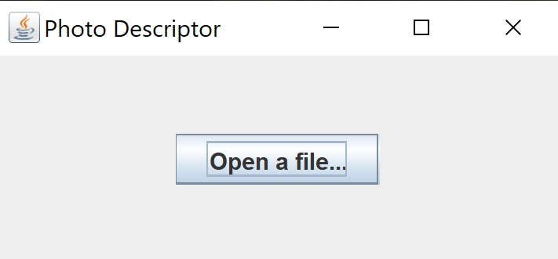

# PhotoDescriptionGenerator
A Java application that uses AWS Rekognition and Polly to create a short description of a given photo.

For determining if there are any people in the photo and details about them (including their genders, ages, moods etc.), Rekognition's Facial Analysis is used (function: _describeFaces()_). 
For determining people's clothes and their surroundings, Rekognition's Label Detection is used (functions: _describeScenery()_ and _describeClothes()_).

These three functions generate the text that gets passed to function _playFinalDescription()_, which uses Polly to generate human-like speech. 

An extremely simple Spring GUI is used for interface that lets a user search for a photo on their computer via a File Chooser.

After choosing a photo and processing it, the program with read the description out loud.

## Results and difficulties
The program does seem to produce somewhat accurate descriptions most of the time. There are certain types of photos that get extremely accurate descriptions (photos of nature, selfies, etc.) but there are many that produce fairly inaccure descriptions as well (photos with lots of people). 
There are multiple reasons for it:
1. Facial analysis depends on analysing faces, and photos with multiple people are more likely to have people turning their faces away, moving or making unusual expressions, which makes the analysis less reliable
2. Rekognition does not differenciate between faces that are barely noticable, cut-off or blurred (basically, in the background) and faces that are in the foreground
3. Since most labels either do not come with bounding boxes at all (which would help identify their relative location to faces, for example) or are not guaranteed to produce one, it is virtually impossible to provide a user with an accurate description of multiple people's outfits

It is not surprising, however, considering that developers most probably did not create this technology for the purpose of describing photos. It is evident by how poor label organization is: there are labels that are not very descriptive (ex. "Weather"), labels that despite being "related" to each other do not share the same ancestor (ex. "Bag" (no parents) and "Handbag" (Parents: "Bag", "Accessories")), labels that mean the same thing but are given different names for some reason (ex. "Person" and "Human", "Female" and "Woman", "Clothing" and "Apparel", "Accessory" and "Accessories"). Even though I tried to minimize a lot of these problems in my algorithm, I only managed to address some of them. I do believe this project would benifit greatly if labeling was done a bit more consistently.

Because of these difficulties, I decided to strictly control which parts of a program description a photo gets:
1. A person's outfit only gets described if there is exactly one person in the photo
2. A group of people gets described in detail only if there have been less than 6 people detected

That also guarantees that photo descriptions do not become exhaustingly long and unnecessary nuanced.

## How to use this program
Before running this program, you need to do the following:
1. Register for AWS Web Services
2. Create a user that has _AmazonRekognitionFullAccess_ and _AmazonPollyFullAccess_ permissions
3. Create access keys and [make a new profile on your machine](https://docs.aws.amazon.com/powershell/latest/userguide/specifying-your-aws-credentials.html). Make sure you assign region to us-east-1.
4. Run _guiDemo.java

.jpg)

## What and who is this program for
The purpose of such software is to introduce an easy way for visually-impaired people to know what is portrayed in a photo. 
Technology these days have become extremely reliant on a person’s ability to perceive the world visually, which greatly reduces mobility of visually-impaired people. The more well-developed these technologies become, the more uses this idea will have in terms of helping visually-impaired people navigate not only their virtual environment but even real-world surroundings. I expect that in the future, when Rekognition will provide an even more accurate and detailed analysis of photos and videos, visually-impaired people will be able to consume all kinds of visual content without much problem. For example, if one can combine some version of Rekognition, Polly, smart glasses and Bluetooth earphones, users will be able get a real-time narration of their real-world surroundings. My program can be a small step in that direction. 
